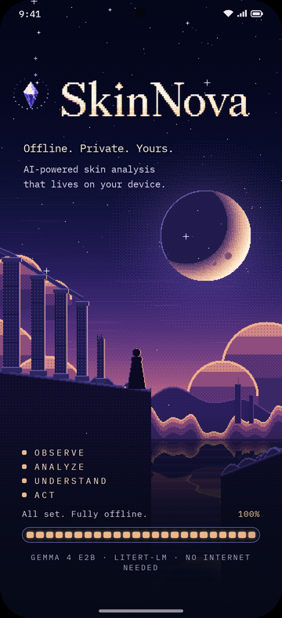
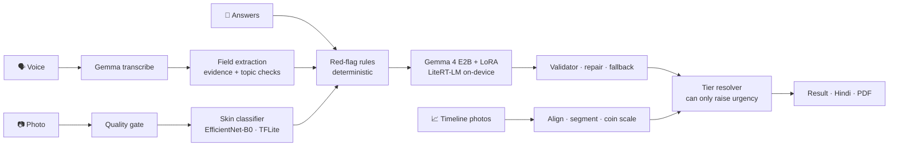

<div align="center">



# SkinNova

### Offline, private, on-device skin information — in English and Hindi

A fine-tuned **Gemma 4 E2B** and a skin-image classifier running **entirely on an Android phone**: photo + symptoms in,
ranked possible conditions, a plain-language explanation, triage advice and a doctor-ready summary out.
No internet. No account. Nothing leaves the device.


</div>

<br clear="right">

## Highlights

| | Achievement | Evidence |
|---|---|---|
| 🔒 | **100 % on-device.** The `offline` build ships with *no internet permission at all* (verified on the built APK) | [`reports/apk_check.json`](reports/apk_check.json) |
| 🧠 | **Fine-tuned Gemma 4 E2B beats stock Gemma** on the same frozen test cases: valid structured output **76.7 % → 99.3 %** (100 % after one self-repair), right condition in the top 3 **66 % → 93 %**, suspicious lesions surfaced **27 % → 100 %** | [`reports/llm_arms.json`](reports/llm_arms.json) |
| 🛡️ | **Safety that cannot be talked out of a referral:** 0 of 32 high-risk cases under-triaged, **30/30 prompt-injection attacks** neutralised, **60/60** red-flag rules, suspicious-lesion recall **91.9 %** | [`reports/safety.json`](reports/safety.json) |
| 📷 | **Skin-image classifier:** **78 % top-1 / 95 % top-3** on 4,342 held-out photos across 10 categories; on outside phone photos of brown skin top-3 rose **29 % → 66 %** after adding Google's SCIN data | [`reports/cv_metrics_v2.json`](reports/cv_metrics_v2.json) |
| 🎯 | **Every conversion verified:** PyTorch → TFLite max Δp **8.4e-5**; fine-tuned model → phone format within **2.5 points** of the original | [`reports/cv_parity.json`](reports/cv_parity.json), [`reports/parity_l6_skinnova_v2.json`](reports/parity_l6_skinnova_v2.json) |
| 📈 | **SkinTimeline** tracks a spot over weeks: **97 %** photo alignment, **5.6 %** median size error with a coin for scale, colour change measured to **~1 ΔE** under changing light | [`reports/timeline_eval_v8.json`](reports/timeline_eval_v8.json) |
| 🚫 | **Skin-photo gate:** a second output of the image model catches **96.8 %** of non-skin photos — everyday objects, rooms and food (COCO) **97.3 %**, wood/fabric/paper textures **91.9 %** — and asks for a retake, while passing **99.1 %** of real skin photos | [`reports/skin_gate_v2.json`](reports/skin_gate_v2.json) |
| 🔁 | **Surer image model on phone photos:** 4-view test-time averaging lifts top-3 on real phone photos (SCIN val) **80.6 % → 83.4 %**, adopted by a rule fixed before the test | [`reports/cv_tta.json`](reports/cv_tta.json) |
| 💬 | **Ask SkinNova:** follow-up questions about a result, answered on the phone by the fine-tuned Gemma in English or Hindi, grounded in reviewed notes; danger signs always trigger a fixed "get care today" line; medicine names, doses and diagnoses are filtered out | [`reports/chat_probe_v2.json`](reports/chat_probe_v2.json) |
| 🌿 | **Home care & relief:** cited home remedies, food & lifestyle notes and common pharmacy options (EN + HI), tailored to age, pregnancy, allergies and health conditions — never self-treatment when a doctor should look first | [`assets/care/relief.json`](android/app/src/main/assets/care/relief.json) |
| 🗣️ | **Bhasha voice intake:** speak symptoms in Hindi or English; **94 %** of fields extracted correctly on held-out test transcripts, and a field is kept only if its quote is in what you said *and* about the right topic | [`reports/llm_litertlm_select_v2.json`](reports/llm_litertlm_select_v2.json) |

All numbers are produced by scripts in [`ml/eval/`](ml/eval) and summarised in **[`reports/final_report.md`](reports/final_report.md)**.

## What it does

1. **Capture** — guided photo with live quality checks (focus, light, skin coverage).
2. **Questions** — one card at a time, or answer by **voice** in Hindi/English; every voice-filled field is shown for confirmation.
3. **Analyze on-device** — the image model scores 10 condition categories; deterministic safety rules set a triage floor;
   the fine-tuned Gemma writes ranked possible categories with reasons, uncertainty, what would help and self-care information.
4. **Result** — red-flag banner (if any) → triage card (LOW / MODERATE / HIGH / URGENT, icon + text) → possible categories
   with likelihood → uncertainty → explanation → next steps. Read-aloud and Hindi toggle.
5. **Home care & relief** — home remedies, food & lifestyle notes and pharmacy options for the leading possibility,
   checked against your profile (age, pregnancy, allergies, conditions); read aloud in English or Hindi.
6. **Ask SkinNova** — ask follow-up questions ("Is it contagious?", "What should I avoid?") and get an on-device answer.
7. **Track & share** — save to an encrypted on-device history, re-photograph a spot with a ghost overlay, and export a
   **Doctor Visit Summary PDF** generated on the phone. A notification tells you when a result is ready.
8. **Private by design** — optional profile and an app lock (PIN + fingerprint) that hides every screen; everything is
   encrypted with Android Keystore keys and never leaves the phone.

The **Skin Library** shows real example photos on different skin tones (SCIN and PAD-UFES-20, CC BY 4.0) with
signs, care and when to see a doctor for each condition.

<p align="center">
  
  
  
</p>

## Architecture



- **Image model** — EfficientNet-B0 at 384 px, temperature-calibrated, averaged over 4 views, exported to TFLite (16 MB,
  bundled), with a second output that recognises whether the photo shows skin at all.
- **Language model** — Gemma 4 E2B, LoRA (r = 16) trained on Kaggle T4 with Unsloth on 3.8 k task records (analysis,
  disagreement, red flags, voice extraction, timeline narration, Hindi translation, injection resistance), merged and
  exported to a 3.9 GB `.litertlm` with litert-torch. On the phone it reasons over the image model's calibrated scores
  and the user's answers — identical results to sending the photo, **46 % faster** ([`docs/decisions.md`](docs/decisions.md)).
- **Safety** — rules, tier floors and validators are plain Kotlin with Python twins and shared JSON fixtures; the model
  can raise urgency but never lower it.
- Details: [`docs/architecture.md`](docs/architecture.md) · data contracts: [`docs/contracts.md`](docs/contracts.md).

## Engineering practices

- **Pre-registered decisions** — every model choice (CV v2, LoRA v2, the timeline segmentation) was decided by a rule
  written down *before* seeing the result, on validation data only ([`docs/decisions.md`](docs/decisions.md)).
- **Frozen evaluation sets** and leakage control — perceptual-hash de-duplication before patient-grouped splits.
- **Parity at every conversion** — PyTorch ↔ TFLite ↔ Kotlin preprocessing, HF ↔ `.litertlm`, Python ↔ Kotlin timeline.
- **One source of truth** for prompts, condition cards and safety terms, shared by training and the app (tested).
- **Reproducible numbers** — each report carries the git commit, dataset revision and model hash.

## Getting started

### Run it on a phone (no computer needed)
1. Download the APK from **[Releases](https://github.com/harsh11067/SkinNova/releases/latest)** on the phone and install it.
2. Download the model `skinnova-e2b-v2.litertlm` (3.9 GB) from the private Hugging Face repo
   **[kumarharsh11067/skinnova-gemma4-e2b-litertlm](https://huggingface.co/kumarharsh11067/skinnova-gemma4-e2b-litertlm)**
   (ask the owner for access) — or Google's public stock [Gemma 4 E2B](https://huggingface.co/litert-community/gemma-4-E2B-it-litert-lm), which the app also accepts.
3. In SkinNova tap **Import model file** and pick it. The app verifies the SHA-256 and runs fully offline from then on.

**Complete guide (phone, developer setup, where every file lives): [`docs/SETUP_GUIDE.md`](docs/SETUP_GUIDE.md).**

### Developers
```bash
git clone git@github.com:harsh11067/SkinNova.git && cd SkinNova
cp .env.example .env                     # HF_TOKEN, KAGGLE_*  (never commit .env)
uv venv .venv && uv pip install --python .venv -r ml/requirements.txt          # training · data · evaluation
uv venv .venv-export && uv pip install --python .venv-export -r ml/requirements-export.txt   # export · LiteRT-LM eval
.venv/bin/python -m pytest -q ml/tests   # 154 tests: rules, validators, prompts, timeline, intake, voice scoring
cd android && ./gradlew :app:testOfflineDebugUnitTest :app:assembleOfflineDebug
```
Setup guide: [`docs/SETUP_GUIDE.md`](docs/SETUP_GUIDE.md) · owner's manual: [`docs/diy.md`](docs/diy.md) · test plan: [`docs/test.md`](docs/test.md) · run log: [`PROGRESS.md`](PROGRESS.md).

## Repository

```
android/   Kotlin + Jetpack Compose app (flavors: offline / online), JVM + on-device tests
ml/        data pipeline · CV training · Gemma LoRA (Kaggle notebooks) · timeline · voice · evaluation
docs/      plan · architecture · contracts · test plan · decisions log
design/    design brief, tokens, HTML prototype
reports/   every metric in this project, written by a script
scripts/   device install / test / benchmark, model push, chained training pipelines
tests/     shared JSON fixtures used by both pytest and JUnit
```

## Roadmap

- **Instant results** on mid-range phones: categories and triage on screen immediately, the explanation streaming in.
- More **brown-skin phone photos** (with consent) to lift outside-photo accuracy further.
- Field study with voice recordings and two-phone airplane-mode runs.

## Responsible use & licences

SkinNova provides preliminary, educational information and clear advice on when to see a doctor; it is not a
medical device and not a substitute for a professional diagnosis.

- **Gemma 4** — [Gemma Terms of Use](https://ai.google.dev/gemma/terms) · **LiteRT / LiteRT-LM** — Apache-2.0
- **Data** — PAD-UFES-20 (CC BY 4.0), SCIN by Google Research & Stanford (CC BY 4.0), SkinDisNet (CC BY-NC 4.0),
  DermNet NZ images via a Kaggle mirror (non-commercial, educational), mgmitesh (CC BY 4.0), Imagenette (ImageNet
  subset, non-commercial research — skin-photo gate negatives only); details in
  [`reports/data_card.md`](reports/data_card.md). Because of the non-commercial sources, the trained models are for
  non-commercial, educational use.
- Condition notes summarised from AAD, NHS and DermNet (cited in the app).
